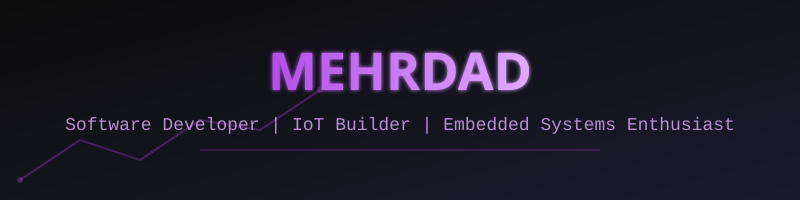
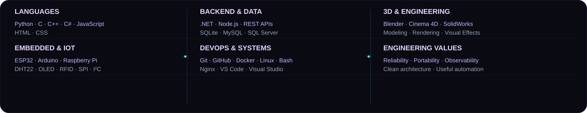
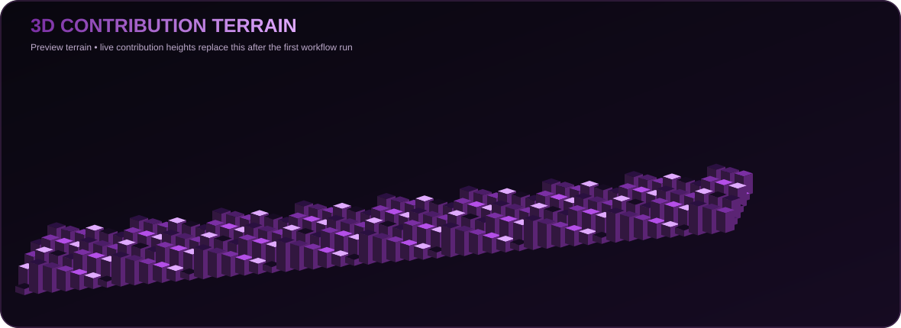
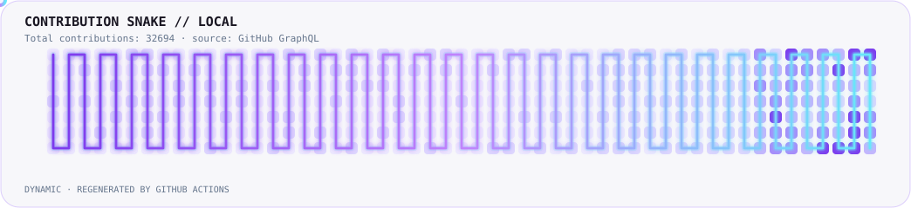
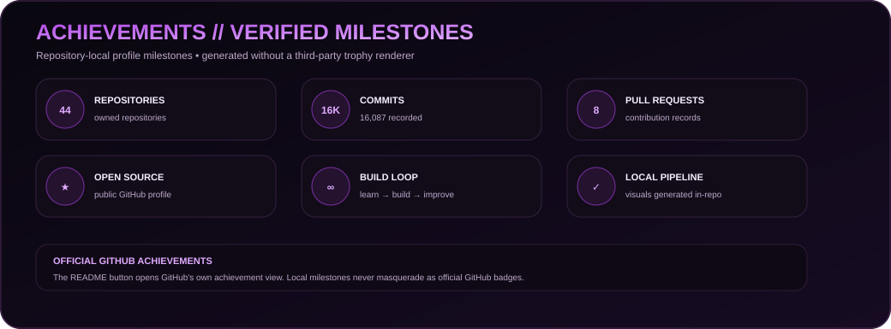
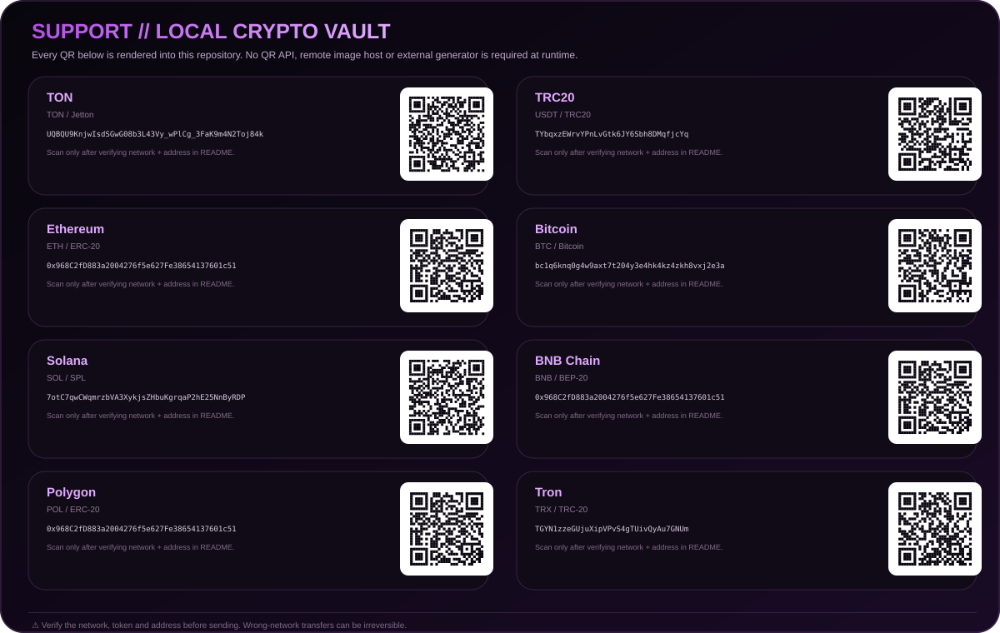
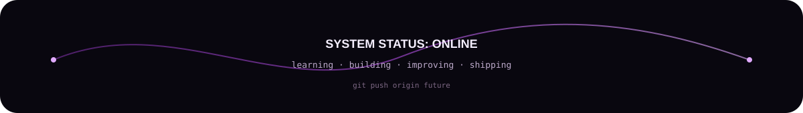

<div align="center">

<a href="https://github.com/mehrdadmb2">
  
</a>

<br/>

<table>
<tr>
<td align="center"><b>Software</b><br/><sub>Python · C/C++ · C# · Web</sub></td>
<td align="center"><b>IoT</b><br/><sub>ESP32 · Arduino · Sensors</sub></td>
<td align="center"><b>Systems</b><br/><sub>Linux · Networking · Docker</sub></td>
<td align="center"><b>3D</b><br/><sub>Blender · C4D · SolidWorks</sub></td>
</tr>
</table>

<br/>

<a href="https://github.com/mehrdadmb2">GitHub</a> ·
<a href="https://mehrdadmb2.github.io/mehrdad-dev/">Portfolio</a> ·
<a href="https://www.linkedin.com/in/mehrdad-mb-658520232">LinkedIn</a> ·
<a href="https://www.instagram.com/_._.m._.b">Instagram</a> ·
<a href="https://x.com/__Mehrdad_">X</a> ·
<a href="https://discord.gg/0mehrdad0">Discord</a>

<br/><br/>

<sub>learn → build → test → automate → ship → improve</sub>

</div>

---

<details open>
<summary><b>🧭 Navigation</b></summary>

<a href="#about--profile">About</a> ·
<a href="#focus--engineering-domains">Focus</a> ·
<a href="#stack--technology-map">Stack</a> ·
<a href="#projects--featured-work">Projects</a> ·
<a href="#stats--github-telemetry">Stats</a> ·
<a href="#achievements--verified-milestones">Achievements</a> ·
<a href="#support--donate">Support</a> ·
<a href="#connect--contact">Contact</a>

</details>

---

## `~/about $ cat profile.json`

### About <a id="about--profile"></a>

```json
{
  "name": "Mehrdad",
  "username": "mehrdadmb2",
  "location": "Shiraz, Iran",
  "field": "Computer Engineering - Software",
  "roles": [
    "Software Developer",
    "IoT Builder",
    "Embedded Systems Enthusiast",
    "3D Designer"
  ],
  "interests": [
    "Internet of Things",
    "Automation",
    "Backend Development",
    "System Programming",
    "3D Design and Visual Effects"
  ],
  "current_status": "Building skills, projects, and a stronger future."
}
```

## `~/intro $ ./about-me`

> I am a Computer Engineering student and technology enthusiast from Shiraz. I like building practical systems that connect software with real hardware — especially ESP32/Arduino projects, sensors, dashboards, automation, data logging, networking and embedded control.
>
> I also work with Python, C/C++, C#, web technologies, Linux, Docker, Blender, SolidWorks and related development/design tooling.
>
> **Engineering principle:** keep systems observable, understandable, reliable and as independent from unnecessary third-party services as practical.

---

## `~/focus $ ls -la`

### Focus & Engineering Domains <a id="focus--engineering-domains"></a>

| Domain | What I Build / Explore |
|---|---|
| 🧠 **Software Engineering** | Python utilities, desktop tools, automation, APIs, backend services and system-oriented software |
| 🛰️ **IoT & Embedded** | ESP32, Arduino, sensors, OLED, RFID, SD logging, device-to-device communication and control |
| 🌐 **Web & Dashboards** | Responsive admin panels, REST APIs, GitHub Pages, monitoring, history and data visualization |
| 🐧 **Networking & Linux** | Diagnostics, Linux tooling, Nginx, Docker, self-hosting and network troubleshooting |
| 🎨 **3D & Visual Design** | Blender, Cinema 4D, SolidWorks, modelling, rendering, compositing and visual effects |

<details>
<summary><b>🧩 Architecture mindset</b></summary>

I prefer projects with explicit interfaces, predictable data formats, local logging, graceful error handling, reproducible builds and minimal unnecessary external dependencies.

</details>

---

## `~/stack $ neofetch --skills`

### Technology Map <a id="stack--technology-map"></a>

<div align="center">

</div>

| Category | Technologies |
|---|---|
| **Languages** | Python, C, C++, C#, JavaScript, HTML, CSS |
| **Embedded & IoT** | ESP32, Arduino, Raspberry Pi, DHT22, OLED, RFID, SPI, I²C |
| **Backend** | .NET, Node.js, REST APIs, Nginx |
| **Databases** | SQLite, MySQL, Microsoft SQL Server |
| **DevOps & Tools** | Git, GitHub, Docker, Linux, Bash, VS Code, Visual Studio |
| **3D & Engineering** | Blender, Cinema 4D, SolidWorks |

<details>
<summary><b>🔍 How I use the stack</b></summary>

**Hardware → firmware → API → dashboard → automation → logs**

I enjoy projects where these layers meet instead of treating them as isolated technologies.

</details>

---

## `~/projects $ find ./featured -maxdepth 1`

### Featured Work <a id="projects--featured-work"></a>

<details open>
<summary><b>🏠 Smart Home Hybrid IoT</b></summary>

A multi-device smart-home platform combining embedded controllers, sensors, local storage, web monitoring and remote control.

```yaml
features:
  - Environmental monitoring
  - Temperature and humidity history
  - SD-card data logging
  - OLED status interface
  - RFID access control
  - Remote door control
  - Device-to-device REST communication
  - Responsive admin dashboard
```

</details>

<details>
<summary><b>📡 ESP32 Environmental Monitor</b></summary>

A standalone monitoring node that reads environmental data, exposes status information and stores daily logs.

```yaml
hardware:
  - ESP32
  - DHT22
  - OLED display
  - MicroSD card module
software:
  - Wi-Fi connectivity
  - Daily CSV files
  - Web dashboard
  - Status/history APIs
```

</details>

<details>
<summary><b>🛠️ Python Utility Applications</b></summary>

Tools focused on automation, network testing, data processing and system troubleshooting.

```yaml
focus:
  - User-friendly interfaces
  - Reliable error handling
  - Exportable reports
  - Multithreading
  - Portable builds
```

</details>

<details>
<summary><b>🌐 Personal Developer Portfolio</b></summary>

A modern portfolio for presenting projects, skills, experiments and contact information.

**[Open repository →](https://github.com/mehrdadmb2/mehrdad-dev)**  ·  **[Open live website →](https://mehrdadmb2.github.io/mehrdad-dev/)**

</details>

---

## `~/learning $ cat roadmap.yml`

```yaml
currently_learning:
  - Advanced ESP32 development
  - IoT architecture and device communication
  - Backend API design
  - Docker and self-hosted automation
  - Machine learning fundamentals
  - Professional 3D workflows

next_targets:
  - Build production-ready IoT systems
  - Publish more open-source projects
  - Improve software architecture skills
  - Create independent technology products
```

---

## `~/stats $ ./github-analytics`

### GitHub Telemetry <a id="stats--github-telemetry"></a>

<div align="center">


<br/><br/>

<a href="https://github.com/mehrdadmb2">
  
</a>

<br/><br/>

<a href="https://github.com/mehrdadmb2">
  
</a>

</div>

<details>
<summary><b>⚙️ How the telemetry is generated</b></summary>

The repository uses a small Python generator and GitHub's own API through the automatically provided workflow token.

```text
GitHub API
    ↓
scripts/generate_profile_assets.py
    ↓
┌─────────────────────────────────────────────┐
│ metrics.svg                                  │
│ profile-3d-contrib/profile-night-rainbow.svg│
│ assets/snake.svg                             │
│ assets/achievements.svg                      │
└─────────────────────────────────────────────┘
```

No GitHub Stats host, external activity-graph renderer or QR-rendering service is required for the local visuals.

</details>

---

## `~/writing $ ./latest-posts`

<!-- BLOG-POST-LIST:START -->
<!-- BLOG-POST-LIST:END -->

The existing blog-post workflow can populate the section above from the configured feeds.

---

## `~/achievements $ ./verify`

### Verified Milestones <a id="achievements--verified-milestones"></a>

<div align="center">

<a href="https://github.com/mehrdadmb2?tab=achievements">

</a>

<br/><br/>

<a href="https://github.com/mehrdadmb2?tab=achievements"><b>Open the official GitHub Achievements page →</b></a>

</div>

<details>
<summary><b>🏆 What is shown here?</b></summary>

The local dashboard intentionally separates **verified repository/profile milestones** from GitHub's proprietary achievement badges.

It is generated from data available through GitHub's API, such as contributions, repositories, stars, pull requests and issues. That means the cards are reproducible inside this repository and do not depend on a third-party trophy renderer.

The official GitHub achievement badges remain available through the button above so the profile never pretends that a locally generated milestone is an official GitHub badge.

</details>

---

## `~/support $ ./donate --interactive`

### Support <a id="support--donate"></a>

If you find my work useful and want to support future open-source projects, the following addresses are available.

<div align="center">

</div>

### 📋 Copy-ready addresses

> **Important:** The blocks below are intentionally separate from the graphic so GitHub's native **Copy** affordance can be used directly on every address.

<details>
<summary><b>🔵 TON</b></summary>

**Network:** TON · Jetton/TON compatible address

```text
UQBQU9KnjwIsdSGwG08b3L43Vy_wPlCg_3FaK9m4N2Toj84k
```

</details>

<details>
<summary><b>🟢 TRC20 — USDT</b></summary>

**Network:** TRON · TRC20

```text
TYbqxzEWrvYPnLvGtk6JY6Sbh8DMqfjcYq
```

</details>

<details>
<summary><b>🟣 Ethereum — ETH / ERC-20</b></summary>

**Network:** Ethereum · ERC-20

```text
0x968C2fD883a2004276f5e627Fe38654137601c51
```

</details>

<details>
<summary><b>🟠 Bitcoin — BTC</b></summary>

**Network:** Bitcoin

```text
bc1q6knq0g4w9axt7t204y3e4hk4kz4zkh8vxj2e3a
```

</details>

<details>
<summary><b>🟢 Solana — SOL / SPL</b></summary>

**Network:** Solana

```text
7otC7qwCWqmrzbVA3XykjsZHbuKgrqaP2hE25NnByRDP
```

</details>

<details>
<summary><b>🟡 BNB Chain — BNB / BEP-20</b></summary>

**Network:** BNB Smart Chain · BEP-20

```text
0x968C2fD883a2004276f5e627Fe38654137601c51
```

</details>

<details>
<summary><b>🟪 Polygon — POL / ERC-20</b></summary>

**Network:** Polygon

```text
0x968C2fD883a2004276f5e627Fe38654137601c51
```

</details>

<details>
<summary><b>🔴 Tron — TRX / TRC-20</b></summary>

**Network:** Tron · TRC-20

```text
TGYN1zzeGUjuXipVPvS4gTUivQyAu7GNUm
```

</details>

> ⚠️ **Always verify the network, token and full address before sending.** A valid-looking address on the wrong network can still result in permanent loss.

<div align="center">

**[GitHub Sponsors](https://github.com/sponsors/mehrdadmb2)**  ·  **[Buy Me a Coffee](https://www.buymeacoffee.com/mehrdadmb2)**

</div>

---

## `~/connect $ cat contact.md`

### Contact & Collaboration <a id="connect--contact"></a>

<div align="center">

<table>
<tr>
<td align="center"><b>💬 Fastest</b><br/><a href="https://t.me/IIMehrdadII">Telegram →</a></td>
<td align="center"><b>📧 Direct</b><br/><a href="mailto:game.developer.mb@gmail.com">Email →</a></td>
<td align="center"><b>💼 Professional</b><br/><a href="https://www.linkedin.com/in/mehrdad-mb-658520232">LinkedIn →</a></td>
<td align="center"><b>🧑‍💻 Technical</b><br/><a href="https://github.com/mehrdadmb2">GitHub →</a></td>
</tr>
</table>

</div>

<br/>

| Channel | Direct action |
|---|---|
| 📧 **Email** | [game.developer.mb@gmail.com](mailto:game.developer.mb@gmail.com) |
| 💬 **Telegram** | [@IIMehrdadII](https://t.me/IIMehrdadII) |
| 📱 **Instagram** | [@_._.m._.b](https://instagram.com/_._.m._.b) |
| 📞 **Phone** | [+98 903 193 7072](tel:+989031937072) |
| 🐙 **GitHub** | [mehrdadmb2](https://github.com/mehrdadmb2) |
| 🔗 **LinkedIn** | [Mehrdad MB](https://www.linkedin.com/in/mehrdad-mb-658520232) |
| 🐦 **X** | [@__Mehrdad_](https://x.com/__Mehrdad_) |
| 🎮 **Discord** | [0mehrdad0](https://discord.gg/0mehrdad0) |

### 🚀 Collaboration launcher

Choose the path that matches what you want to discuss:

| Need | Recommended route |
|---|---|
| **Project / freelance** | [Send an email](mailto:game.developer.mb@gmail.com?subject=Project%20Inquiry) |
| **Technical question** | [Open a GitHub contact issue](https://github.com/mehrdadmb2/mehrdadmb2/issues/new?template=contact.yml) |
| **Open-source collaboration** | [Open a GitHub issue](https://github.com/mehrdadmb2/mehrdadmb2/issues/new?template=contact.yml) |
| **Quick message** | [Message me on Telegram](https://t.me/IIMehrdadII) |
| **Professional networking** | [Connect on LinkedIn](https://www.linkedin.com/in/mehrdad-mb-658520232) |

<details>
<summary><b>✉️ GitHub-native contact form</b></summary>

The repository includes a structured GitHub Issue Form so no third-party form provider is required.

**[Open Contact / Collaboration Form →](https://github.com/mehrdadmb2/mehrdadmb2/issues/new?template=contact.yml)**

Please do **not** publish passwords, API tokens, private keys, seed phrases or other secrets in a public issue.

</details>

<details>
<summary><b>🔐 Privacy & contact preference</b></summary>

For sensitive or private topics, prefer direct email rather than creating a public GitHub issue.

For technical topics that benefit from public documentation or community visibility, a GitHub issue is usually the better route.

</details>

---

## `~/metrics $ uptime`

<div align="center">

[](https://github.com/mehrdadmb2?tab=followers)
[](https://github.com/mehrdadmb2)
[](https://github.com/mehrdadmb2/mehrdadmb2/commits/main)
[](https://github.com/mehrdadmb2)

</div>

<br/>

<div align="center">

</div>

<details>
<summary><b>🔧 Repository maintenance</b></summary>

The profile visuals are generated locally by GitHub Actions from repository-owned source code.

```text
.github/workflows/profile-assets.yml
            │
            ▼
scripts/generate_profile_assets.py
            │
            ├── metrics.svg
            ├── achievements.svg
            ├── profile-3d-contrib/profile-night-rainbow.svg
            └── assets/snake.svg
```

The pipeline is scheduled daily and can also be triggered manually from **Actions → Generate local profile visuals → Run workflow**.

</details>

<div align="center">

```text
[ system status ]  Online.
[ current task  ]  Learning, building and improving.
[ next command  ]  git push origin future
```

</div>
