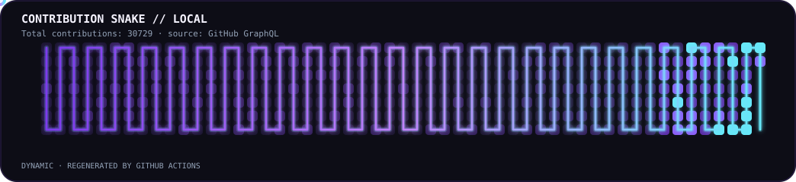
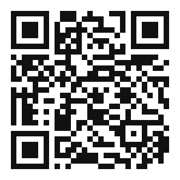

<div align="center">

<a href="https://github.com/mehrdadmb2">
  
</a>

<br>

<a href="https://github.com/mehrdadmb2">
  
</a>
<a href="https://mehrdadmb2.github.io/mehrdad-dev/">
  
</a>
<a href="https://www.linkedin.com/in/mehrdad-mb-658520232">
  
</a>
<a href="https://t.me/IIMehrdadII">
  
</a>
<a href="mailto:game.developer.mb@gmail.com">
  
</a>
<a href="https://discord.gg/0mehrdad0">
  
</a>
<a href="https://x.com/__Mehrdad_">
  
</a>

<br><br>

<details>
<summary><b>⚡ Quick navigation</b></summary>
<br>
<a href="#whoami">Whoami</a> ·
<a href="#focus">Focus</a> ·
<a href="#stack">Stack</a> ·
<a href="#featured-builds">Builds</a> ·
<a href="#github-command-center">GitHub command center</a> ·
<a href="#achievements">Achievements</a> ·
<a href="#contributions">Contributions</a> ·
<a href="#support">Support</a> ·
<a href="#connect">Connect</a>
</details>

<br>


</div>

---

<a id="whoami"></a>
## `~/whoami $ cat profile.json`

```json
{
  "name": "Mehrdad",
  "username": "mehrdadmb2",
  "location": "Shiraz, Iran",
  "field": "Computer Engineering - Software",
  "roles": [
    "Software Developer",
    "IoT Builder",
    "Embedded Systems Enthusiast",
    "3D Designer"
  ],
  "interests": [
    "Internet of Things",
    "Automation",
    "Backend Development",
    "System Programming",
    "3D Design and Visual Effects",
    "Networking",
    "Developer Tooling"
  ],
  "philosophy": "Learn continuously. Build practical systems. Ship useful things.",
  "status": "Always learning, always building."
}
```

## `~/about $ ./about-me`

> I like the point where software stops being only software.
>
> I build practical systems that connect **code, hardware, data, networking and visual design** — from ESP32/Arduino devices and sensor networks to Python tooling, dashboards, automation, APIs and 3D workflows.
>
> My favorite projects are the ones that solve a real problem, survive real-world constraints, and can be improved over time.

---

<a id="focus"></a>
## `~/focus $ ls --profile`

| Domain | Current direction |
|---|---|
| **IoT & Embedded** | ESP32, Arduino, DHT22, OLED, RFID, SD logging, SPI, I²C, device-to-device communication |
| **Software** | Python utilities, C/C++, C#, automation, desktop tooling, backend services |
| **Web** | Responsive interfaces, dashboards, REST APIs, GitHub Pages, developer tooling |
| **Networking** | Troubleshooting, DNS, Linux networking, Nginx, Docker, self-hosted services |
| **3D / Design** | Blender, Cinema 4D, SolidWorks, modeling, rendering, visual effects |
| **Engineering mindset** | Reliability, portability, observability, clean architecture, useful automation |

---

<a id="stack"></a>
## `~/stack $ neofetch --skills`

<div align="center">
  
</div>

<details>
<summary><b>🧩 Stack details</b></summary>
<br>

| Category | Technologies |
|---|---|
| **Languages** | Python · C · C++ · C# · JavaScript · HTML · CSS |
| **Embedded** | ESP32 · Arduino · Raspberry Pi · DHT22 · OLED · RFID · SPI · I²C |
| **Backend** | .NET · Node.js · REST APIs · Nginx |
| **Databases** | SQLite · MySQL · Microsoft SQL Server |
| **DevOps & Tools** | Git · GitHub · Docker · Linux · Bash · VS Code · Visual Studio |
| **3D & Engineering** | Blender · Cinema 4D · SolidWorks |

</details>

---

<a id="featured-builds"></a>
## `~/projects $ tree ./featured`

### 🏠 SmartHome Hybrid IoT

A resilient, multi-node IoT platform: ESP32 sensor nodes and an Arduino-based RFID door-access node work together, log to SD storage, sync to a local dashboard, and keep working even when the network drops.

```yaml
architecture:
  master:
    - ESP32 / ESP32-S3
    - SSD1306 OLED status display
    - DHT22 temperature & humidity sensing
    - Wi-Fi + GitHub Pages sync
  slave:
    - Arduino UNO
    - MFRC522 RFID reader
    - Relay-driven door / lock control
  data:
    - SD card CSV logging
    - Historical readings
    - Downloadable records
  interface:
    - Local dashboard with charts
    - Auto-recovery on node / network failure
```

<details>
<summary><b>🔍 Related repositories</b></summary>
<br>

[`SmartHome-Hybrid-IoT`](https://github.com/mehrdadmb2/SmartHome-Hybrid-IoT) · [`Arduino-RFID-Relay-Control`](https://github.com/mehrdadmb2/Arduino-RFID-Relay-Control) · [`ESP32-RFID-DHT-OLED-WebDashboard`](https://github.com/mehrdadmb2/ESP32-RFID-DHT-OLED-WebDashboard) · [`esp32-dht22-data-logger`](https://github.com/mehrdadmb2/esp32-dht22-data-logger)

</details>

### 📡 ESP32 Environmental Monitor

Dual-node environmental monitoring: DHT22 sensors feed a live web dashboard and an on-device OLED, with SD card logging and historical charts for offline review.

```yaml
hardware:
  - ESP32 (dual-node)
  - DHT22
  - SSD1306 OLED
  - MicroSD
software:
  - Wi-Fi
  - web dashboard with historical charts
  - local + remote data logging
```

<details>
<summary><b>🔍 Related repositories</b></summary>
<br>

[`ESP32-DualNode-Environmental-Monitor`](https://github.com/mehrdadmb2/ESP32-DualNode-Environmental-Monitor) · [`ESP32-DHT22-OLED-Monitor`](https://github.com/mehrdadmb2/ESP32-DHT22-OLED-Monitor)

</details>

### 🧾 License Renewal Fine Calculator

A single-file, Jalali/Shamsi-calendar-aware web tool that calculates overdue license-renewal penalties — overdue months × monthly fine, plus the fixed renewal fee — behind a responsive, modern neon interface.

<a href="https://github.com/mehrdadmb2/javaz-renewal-calculator">
  
</a>

### 🛠️ Developer Tooling & Utilities

```yaml
focus:
  - network diagnostics
  - automation
  - data processing
  - desktop utilities
  - CLI tools
  - error-tolerant workflows
  - exportable reports
```

<details>
<summary><b>🔍 Related repositories</b></summary>
<br>

[`dns-quality-tester`](https://github.com/mehrdadmb2/dns-quality-tester) · [`dual-ping-monitor`](https://github.com/mehrdadmb2/dual-ping-monitor) · [`Windows-Network-Repair`](https://github.com/mehrdadmb2/Windows-Network-Repair) · [`github-profile-studio`](https://github.com/mehrdadmb2/github-profile-studio)

</details>

### 🌐 Developer Portfolio

A visual portfolio for projects, technical interests and a developer identity.

<a href="https://mehrdadmb2.github.io/mehrdad-dev/">
  
</a>

---

<a id="github-command-center"></a>
## `~/github-command-center $ ./metrics --live`

This section is generated by **lowlighter/metrics**, the repository that powers the profile analytics layer. The current Metrics release line exposes a large plugin ecosystem, including isometric calendars, languages, achievements, habits, notable contributions, activity and repository views. Full plugin documentation: [lowlighter/metrics](https://github.com/lowlighter/metrics).

### 📊 Core dashboard

<p align="center">
  <a href="https://github.com/mehrdadmb2">
    
  </a>
</p>

### 🧮 Isometric contribution terrain

<p align="center">
  
</p>

### 🈷️ Language fingerprint

<p align="center">
  
</p>

### 🏆 Achievement matrix

<p align="center">
  
</p>

### 🧠 Coding habits

<p align="center">
  
</p>

### 🎩 Notable contributions

<p align="center">
  
</p>

### 📰 Recent activity

<p align="center">
  
</p>

<details>
<summary><b>📚 Repository landscape</b></summary>
<br>
<p align="center">
  
</p>
</details>

<details>
<summary><b>📆 Full contribution history</b></summary>
<br>
<p align="center">
  
</p>
</details>

<details>
<summary><b>🧬 Lines changed over time</b></summary>
<br>
<p align="center">
  
</p>
</details>

---

<a id="achievements"></a>
## `~/achievements $ ./unlock`

The achievement panel is generated directly by the **Metrics achievements plugin**, rather than a manually maintained trophy image. The official plugin supports compact/detailed displays, filters and thresholds; this setup keeps the data dynamic and repository-local.

<p align="center">
  
</p>

<div align="center">
  <a href="https://github.com/mehrdadmb2?tab=achievements">
    
  </a>
</div>

---

<a id="contributions"></a>
## `~/contributions $ ./snake --watch`

<div align="center">
  <picture>
    <source media="(prefers-color-scheme: dark)" srcset="assets/snake-dark.svg">
    <source media="(prefers-color-scheme: light)" srcset="assets/snake.svg">
    
  </picture>
</div>

> The snake is intentionally a separate visual layer: Metrics handles analytics, while the local SVG keeps the animated contribution-wall effect lightweight and easy to maintain.

---

## `~/roadmap $ cat roadmap.yml`

```yaml
now:
  - Advanced ESP32 development
  - Reliable IoT device communication
  - Better API and backend architecture
  - Docker and self-hosted automation
  - Professional 3D workflows
  - Building stronger open-source projects

next:
  - Production-ready IoT platforms
  - More reusable developer tools
  - Better observability and testing
  - Independent technology products
  - More public documentation
```

---

<a id="support"></a>
## `~/support $ ./donate --interactive`

<div align="center">

Support helps fund hardware experiments, software projects, open-source tooling and future prototypes.

</div>

> ⚠️ **Network safety:** always verify the blockchain, network and asset before sending. Never send a token through a different network just because the address format looks valid.

| Network | Asset | Address | QR |
|:---:|:---:|---|:---:|
| **TON** | TON / compatible token | `UQBQU9KnjwIsdSGwG08b3L43Vy_wPlCg_3FaK9m4N2Toj84k` |  |
| **TRON** | USDT / TRC20 | `TYbqxzEWrvYPnLvGtk6JY6Sbh8DMqfjcYq` |  |
| **Ethereum** | ETH / ERC20 | `0x968C2fD883a2004276f5e627Fe38654137601c51` |  |
| **Bitcoin** | BTC | `bc1q6knq0g4w9axt7t204y3e4hk4kz4zkh8vxj2e3a` |  |
| **Solana** | SOL / SPL | `7otC7qwCWqmrzbVA3XykjsZHbuKgrqaP2hE25NnByRDP` |  |
| **BNB Smart Chain** | BNB / BEP20 | `0x968C2fD883a2004276f5e627Fe38654137601c51` |  |
| **Polygon** | POL / compatible token | `0x968C2fD883a2004276f5e627Fe38654137601c51` |  |
| **TRON** | TRX / TRC20 | `TGYN1zzeGUjuXipVPvS4gTUivQyAu7GNUm` |  |

<details>
<summary><b>📋 Copy-ready addresses</b></summary>

```text
TON
UQBQU9KnjwIsdSGwG08b3L43Vy_wPlCg_3FaK9m4N2Toj84k

USDT — TRC20 / TRON
TYbqxzEWrvYPnLvGtk6JY6Sbh8DMqfjcYq

Ethereum — ETH / ERC20
0x968C2fD883a2004276f5e627Fe38654137601c51

Bitcoin — BTC
bc1q6knq0g4w9axt7t204y3e4hk4kz4zkh8vxj2e3a

Solana — SOL / SPL
7otC7qwCWqmrzbVA3XykjsZHbuKgrqaP2hE25NnByRDP

BNB Smart Chain — BNB / BEP20
0x968C2fD883a2004276f5e627Fe38654137601c51

Polygon — POL
0x968C2fD883a2004276f5e627Fe38654137601c51

TRON — TRX / TRC20
TGYN1zzeGUjuXipVPvS4gTUivQyAu7GNUm
```

</details>

<div align="center">

<a href="https://github.com/sponsors/mehrdadmb2">
  
</a>
<a href="https://www.buymeacoffee.com/mehrdadmb2">
  
</a>

</div>

---

<a id="connect"></a>
## `~/connect $ ./open-channel`

<div align="center">

### 🤝 Let's build something useful

Pick the channel that matches the conversation. For private or sensitive details, email is the preferred path.

</div>

| Channel | Best for | Open |
|:---:|---|:---:|
| 📧 **Email** | Private / detailed communication | [game.developer.mb@gmail.com](mailto:game.developer.mb@gmail.com) |
| 💬 **Telegram** | Quick messages / collaboration | [@IIMehrdadII](https://t.me/IIMehrdadII) |
| 🐙 **GitHub** | Code, issues, pull requests | [mehrdadmb2](https://github.com/mehrdadmb2) |
| 🔗 **LinkedIn** | Professional networking | [Mehrdad MB](https://www.linkedin.com/in/mehrdad-mb-658520232) |
| 📸 **Instagram** | Visual / informal contact | [@_._.m._.b](https://instagram.com/_._.m._.b) |
| 🐦 **X** | Public updates / short-form contact | [@__Mehrdad_](https://x.com/__Mehrdad_) |
| 🎮 **Discord** | Community / real-time chat | [0mehrdad0](https://discord.gg/0mehrdad0) |
| 📱 **Phone** | Direct contact | [+98 903 193 7072](tel:+989031937072) |

<details>
<summary><b>✉️ Open the GitHub-native contact form</b></summary>
<br>

For project ideas, technical questions, collaboration or open-source work, use the repository's structured Issue Form:

**[→ Open Contact / Collaboration Form](https://github.com/mehrdadmb2/mehrdadmb2/issues/new?template=contact.yml)**

Do not include passwords, API keys, private tokens, authentication cookies, wallet seed phrases or other confidential information.

</details>

<details>
<summary><b>🧭 What makes a useful message?</b></summary>

**Project collaboration:** idea + current stack + desired outcome + what kind of help you need.

**Technical question:** environment + exact error + expected behaviour + what you already tried.

**Professional contact:** role + organization (when relevant) + purpose + preferred follow-up channel.

</details>

---

## `~/blog $ tail -n 6 latest.log`

<!-- BLOG-POST-LIST:START -->
- [mehrdadmb2 pushed PySmartHome-PC](https://github.com/mehrdadmb2/PySmartHome-PC/compare/499a001737...0112a22097)
- [mehrdadmb2 pushed PySmartHome-PC](https://github.com/mehrdadmb2/PySmartHome-PC/compare/fb0cdbfe86...ef012bdc54)
- [mehrdadmb2 pushed PySmartHome-PC](https://github.com/mehrdadmb2/PySmartHome-PC/compare/12636f5987...d5c164f620)
- [mehrdadmb2 pushed PySmartHome-PC](https://github.com/mehrdadmb2/PySmartHome-PC/compare/89682d29ea...833f688071)
- [mehrdadmb2 pushed PySmartHome-PC](https://github.com/mehrdadmb2/PySmartHome-PC/compare/3166d1e057...89682d29ea)
- [mehrdadmb2 pushed PySmartHome-PC](https://github.com/mehrdadmb2/PySmartHome-PC/compare/9ff3c2283a...64a9c9c863)
<!-- BLOG-POST-LIST:END -->

The blog section is refreshed automatically by GitHub Actions from the feeds configured in `.github/workflows/blog-posts.yml`.

---

## `~/status $ uptime`

<div align="center">
  
</div>

```text
[ STATUS ] ONLINE
[ MODE   ] BUILD
[ STACK  ] SOFTWARE + IOT + EMBEDDED + 3D
[ GOAL   ] TURN IDEAS INTO USEFUL SYSTEMS
[ NEXT   ] git push origin future
```

<div align="center">
  <sub>Profile analytics generated by lowlighter/metrics · Visual assets generated and stored in this repository</sub>
</div>
